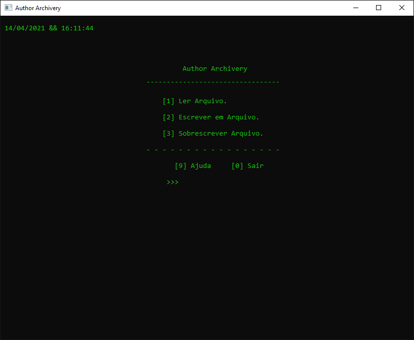
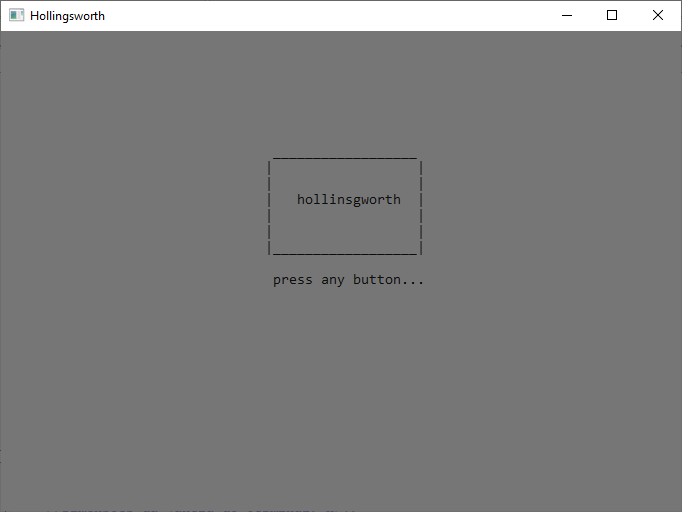

## Apresentação Geral

**Nome do Projeto:** Projetos C

**Descrição:**

Neste repositório, você encontrará uma coleção das minhas experiências com a linguagem C. Ele inclui exercícios do URI Online Judge, desafios de maratonas de programação e dois projetos de estudo. Abaixo estão algumas amostras do conteúdo disponível.

- [Author](https://github.com/Edssaac/projetos-c/tree/main/Author)

  Um editor de texto totalmente programado em C, que permite criar, ler e sobrescrever arquivos existentes.

   

- [Hollingsworth](https://github.com/Edssaac/projetos-c/tree/main/Hollingsworth)

  Um jogo de texto simples, mas ainda em desenvolvimento, programado para ser jogado diretamente no terminal. A progressão da história é baseada nas escolhas feitas pelo jogador. Fortemente inspirado nos clássicos   livros-jogos de RPG, esta releitura programada demonstra um pouco do que a linguagem C tem a oferecer.
 
  

**Tecnologias Utilizadas:**

## Contato

